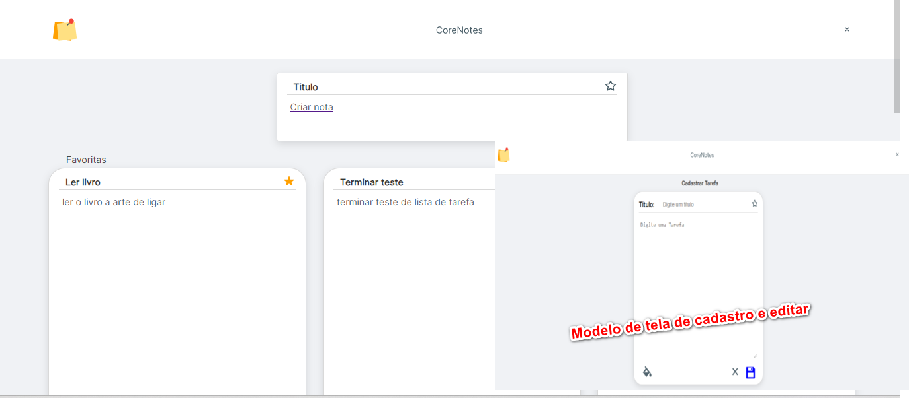

# Projeto desenvolvido com

Este Projeto onde é possivel listar, visualizar, criar, editar, excluir tarefas .

 

  

  <!-- <iframe width="560" height="315" src="./pet/public/Video_2023-06-15_210440.gif" frameborder="0" allow="accelerometer; autoplay; encrypted-media; gyroscope; picture-in-picture" allowfullscreen></iframe> -->

## Site do Projeto

## Repositorio do Projeto

https://github.com/JacquelineCasali/Front--Back--ListadeTarefas

## Instalação

## FRONTEND

1. `cd site`
2. `npm install`
3. `npm start`

## BackEnd

1. `cd server`
2. `npm install`
3. `npm run dev`

## BackEnd

- Cria tarefa no banco de dados
- Ler tarefa no banco de dados
- Atualizar tarefa no banco de dados
- Excluir tarefa no banco de dados
- Clique no cartão para editar e excluir

## Bibliotecas Usadas

## FRONTEND
- `Axios`
- `React.js`

## BackEnd

- `Express`
- `PostgreSQL`
- `Node.js`
- `cors `
- `nodemon`

